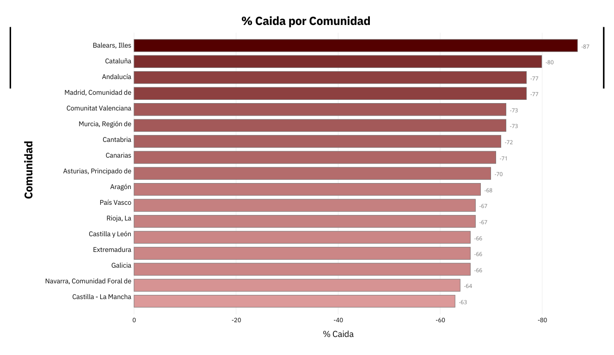
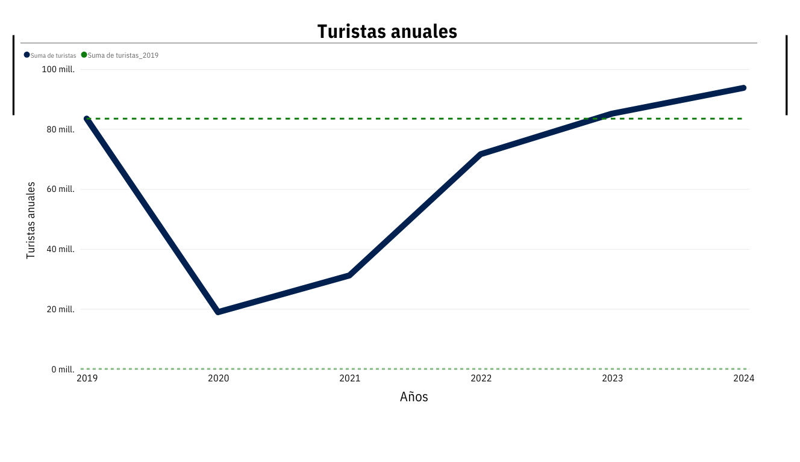

# 🏖️ Impact of COVID-19 on Tourism in Spain — Case Study


**Autor:** Valeria Medina  
**Herramientas:** SQL · Power BI · Excel  
**Fuente de datos:** Instituto Nacional de Estadística (INE) – Estadísticas de Movimientos Turísticos (FRONTUR)

---
## Estructura de datos del proyecto

```
project
│
├── data
│   ├── datos_INE_raw
│   │   └── turistas_x_comunidad_destino.csv
│   │
│   └── datos_INE_limpios
│        └── turistas_x_comunidad_destino.csv
│
├──img
|
├──sql
|  └── exploratory_analysis.sql
│       
├── LICENSE
└── README.md
```
---

## Estado del proyecto ‖ Updates
**En desarrollo:**  
- [x] Crear proyecto ‖ 27/11/25 - Proyecto creado (estructura inicial)
- [x] [Diseño de preguntas](https://github.com/Valmegu/Tourism-Spain-COVID19-CaseStudy-SQL/tree/main?tab=readme-ov-file#preguntas-clave)‖ 28/11/25 - Definir datasets a usar, redactar pregunta inicial y objetivos
- [x] [Descripción de los datos](https://github.com/Valmegu/Tourism-Spain-COVID19-CaseStudy-SQL/tree/main#descripci%C3%B3n-de-los-datos) ‖ 28/11/25 - Describir origen de los datos
- [x] [Limpieza y estructura en Excel](https://github.com/Valmegu/Tourism-Spain-COVID19-CaseStudy-SQL/blob/main/README.md#preparaci%C3%B3n-y-limpieza-de-datos) ‖ 29/11/25 - Limpieza inicial en Excel
- [x] [Comprobación de datos](https://github.com/Valmegu/Tourism-Spain-COVID19-CaseStudy-SQL/blob/main/README.md#comprobaci%C3%B3n-de-datos) ‖ 01/12/25 - Comprobaciones previas al análisis
- [x] [Analisis parte 1](https://github.com/Valmegu/Tourism-Spain-COVID19-CaseStudy-SQL/tree/main#1-qu%C3%A9-tan-fuerte-fue-la-ca%C3%ADda-en-2020-comparado-con-2019-1) ‖ 02/12/25 - Primera parte del análisis
- [ ] [Análisis parte 2](https://github.com/Valmegu/Tourism-Spain-COVID19-CaseStudy-SQL/tree/main#2-en-qu%C3%A9-a%C3%B1o-comenz%C3%B3-la-recuperaci%C3%B3n-real-20212024-1)  ‖ 03/12/25 - Iniciamos la segunda pregunta
- [ ] Análisis parte 3  ‖ 
- [ ] Análisis parte 4  ‖ 
- [ ] Conclusiones finales

---

## Descripción 

Este proyecto personal tiene como objetivo practicar habilidades de análisis de datos, SQL y storytelling.  
A partir de los datos oficiales del Instituto Nacional de Estadística analizamos cómo la pandemia de **COVID-19 afectó al turismo en España** durante 2020 y cómo ha sido su proceso de recuperación.

El objetivo final es **medir la magnitud del descenso de turistas** y **determinar si en 2024 el país ya ha recuperado o superado los niveles previos a la pandemia**.

---

## Preguntas clave

### 1. ¿Qué tan fuerte fue la caída en 2020 comparado con 2019?
- Caída absoluta  
- Caída porcentual  
- Caída por comunidad  

### 2. ¿En qué año comenzó la recuperación real (2021–2024)?
- Crecimiento YoY  
- Comparación entre regiones  

### 3. ¿En 2024 el turismo ya superó los niveles de 2019?
- Total nacional  
- Ranking por comunidad  
- Cuota del turismo nacional  

### 4. ¿Qué comunidades muestran la recuperación más rápida?

---

## Descripción de los datos

Para este análisis usaremos los datasets proporcionados por el Instituto Nacional de Estadística (INE) relacionados con el movimiento turístico y la actividad hotelera.

[Estadística de movimientos turísticos en frontera](https://www.ine.es/dyngs/INEbase/operacion.htm?c=Estadistica_C&cid=1254736176996&menu=ultiDatos&idp=1254735576863)
  - Número de turistas según comunidad autónoma de destino principal
  - Número de turistas según país de residencia

[Coyuntura Turística Hotelera (EOH/IPH/IRSH)](https://www.ine.es/dyngs/INEbase/operacion.htm?c=Estadistica_C&cid=1254736177015&menu=ultiDatos&idp=1254735576863)
  - Viajeros, pernoctaciones por tipo de alojamiento por comunidades y ciudades autónomas

Al usar diferentes datasets para este proyecto, establecemos una prioridad entre cada tabla, se determinó que el orden de importancia es el siguiente:
  - **Tabla 1** — Turistas por comunidad autónoma (Dataset principal)\
Se compone de:
      - Comunidades autónomas
      - Tipo de dato (Dato base / Tasa de variación anual)
      - Periodo (año)
      - Total (Total de turistas registrados)

  - **Tabla 2** — Ocupación hotelera por comunidad (Opcional)
  - **Tabla 3** — Turistas por país de procedencia (Opcional)

El objetivo es consolidar estas tablas en un modelo analítico que permita medir el impacto del COVID-19 en el sector turístico español de forma consistente y comparable.

---

## Preparación y Limpieza de datos
### Turistas por comunidad autónoma:

Nos centraremos en los datos entre 2019 y 2024 (6 años), por comunidad autónoma y únicamente con datos base. 
> [!NOTE]
> Las estimaciones por comunidad autónoma no tienen por qué coincidir con el total nacional, ya que el INE utiliza procedimientos estadísticos independientes para cada nivel territorial. Yo utilicé la suma de los totales por comunidad como proxy para el total nacional.

La limpieza inicial se realizó en Excel para:

1. Filtrar solo registros con Tipo de dato “Dato Base”\
Eliminamos datos de tipo "Variación anual"
2. Eliminar datos fuera de rango (2019 a 2024)\
Se descartan valores anteriores y posteriores
3. Eliminar los totales nacionales (“Total”)\
Para evitar duplicidades y mantener consistencia a nivel regional.
4. Normalizar valores numéricos
   - Eliminar puntos de miles
   - Eliminar comas innecesarias
   - Convertir el campo Total a número entero
   - Convertir celdas vacías ('') en valores nulos (NULL)
5. Estandarizar los nombres de columnas\
(Comunidad, Periodo, Turistas, etc.)
6. Extraer código por comunidad\
No es obligatorio para este análisis, pero útil para posibles integraciones (hotelera, procedencia).
7. Guardar el dataset final como CSV UTF-8\
Para importarlo sin problemas a SQLite/DBeaver.

---

## Comprobación de datos

Antes de empezar a responder las preguntas iniciales, se hace una última comprobación con SQL.
Se crea un dataset denominado turistas_comunidad_clean, en el que volvemos a comprobar que los valores estén en el formato necesario para realizar el análisis.\
➡ [Ver archivo](/sql/exploratory_analysis.sql)

### Resultados

| Validación                   | Resultado                                      |
| ---------------------------- | ---------------------------------------------- |
| Cantidad total de filas      | **114**                                        |
| Total de comunidades         | **19** (17 CCAA + 2 ciudades autónomas)        |
| Rango de años                | **2019–2024** (6 años)                         |
| Registros esperados (19 × 6) | **114** → Todo correcto                        |
| Valores nulos o vacíos       | **4 registros** (Ceuta y Melilla en 2019–2020) |

### Valores Faltantes

|Periodo|Comunidad|Turistas |
| ------|---------|-------- |
|2019   |Ceuta    |**0**    |
|2019   |Melilla  |**0**    |
|2020   |Ceuta    |**0**    |
|2020   |Melilla  |**0**    |

Debido a que Ceuta y Melilla no cuentan con datos para 2019 y 2020, no será posible incluirlas en los análisis comparativos (caída 2020, recuperación vs 2019, etc.). Se mantienen en el dataset por transparencia, pero se excluyen en los cálculos que lo requieren.

---

## Analisis

Pasamos a responder una a una las preguntas planteadas anteriormente

### 1. ¿Qué tan fuerte fue la caída en 2020 comparado con 2019?

La primera pregunta del análisis aborda el impacto inicial de la pandemia en el turismo español. Para ello comparamos 2019 (año base previo al COVID-19) con 2020 (año de restricciones y paralización global). El objetivo es identificar qué comunidades experimentaron las mayores pérdidas y cómo varió la magnitud del impacto entre regiones.

#### ➤ **Caída absoluta (2019 → 2020)**

Comparamos el total de turistas de cada comunidad en 2019 vs 2020 para medir cuántos turistas se perdieron en números absolutos. Las mayores caídas fueron:

|Comunidad|Turistas 2019|Turistas 2020|Diferencia|
|---|---|----|-----|
|Cataluña|19.375.152|3.870.259|**-15.504.893**|
|Illes Balears|13.679.781|1.721.123|**-11.958.658**|
|Canarias	|13.146.863|	3.787.228	|**-9.359.635**|
|Andalucía	|12.023.153	|2.700.613	|**-9.322.540**|
|Comunitat Valenciana	|9.535.496|2.542.758|	**-6.992.738**|

Estas comunidades a su vez registraron la mayor cantidad de turistas en el 2019, por lo que es normal observar mayores pérdidas en volumen.
    
#### ➤ **Caída porcentual (2019 → 2020)**

Es necesario saber de manera porcentual cuáles fueron las comunidades con más pérdidas
Calculamos el porcentaje de disminución tomando como base el valor de 2019 y comparando la diferencia respecto al año 2020

$$Pérdidas = \frac{(Turistas2020-Turistas2019)}{Turistas2019} x 100$$

Esta vez, los resultados muestran un patrón diferente

|Comunidad|Turistas 2019|Turistas 2020|Porcentaje de pérdida|
|---|---|---|---|
|Illes Balears|	13.679.781	|1.721.123	|-87.0|
|Cataluña	|19.375.152|	3.870.259	|-80.0|
|Comunidad de Madrid|	7.640.980|	1.718.335|	-77.0|
|Andalucía|	12.023.153	|2.700.613|	-77.0|
|Región de Murcia	|1.037.818|	279.245	|-73.0|

Este análisis nos revela algo mucho más interesante. El impacto de pérdidas no está ligado al volumen total de turistas.
Murcia y Madrid entran en las comunidades con mayores pérdidas y Baleares tiene una caída mayor que Cataluña a pesar de tener menos turistas en 2019.

#### ➤ **Caída por comunidad (Ranking porcentual)**

La caída turística en 2020 fue profunda en todas las comunidades autónomas, pero no de forma uniforme.
En términos absolutos, Cataluña, Baleares, Canarias, Andalucía y la Comunitat Valenciana fueron las más afectadas por volumen.
Sin embargo, el impacto proporcional fue más severo en Illes Balears (–87%), seguida de Cataluña (–80%), Madrid y Andalucía (–77%)

Para visualizar estas diferencias de forma más clara, se presenta el siguiente ranking de caída por comunidad:

<p align="center">
  
</p>

___

### 2. ¿En qué año comenzó la recuperación real (2021–2024)?

Para identificar cuándo se inició la recuperación turística tras la pandemia, analizamos la evolución anual del total nacional de turistas entre 2019 y 2024. Este enfoque permite observar el comportamiento global antes de profundizar por comunidad autónoma.

#### ➤ **Crecimiento YoY**  

<p align="center">
  
</p>

El gráfico muestra tres fases muy marcadas:
   - 2020: El turismo sufre un colapso histórico debido a las restricciones globales.
   - 2021–2022: Comienza la recuperación. 2021 muestra un aumento moderado, pero es en 2022 cuando se observa un repunte significativo.
   - 2023–2024: Se alcanza la recuperación real.
      - En 2023: El volumen turístico vuelve a situarse ligeramente por encima del nivel pre-pandemia, marcado en el gráfico con la linea verde punteada.
      - En 2024: España no solo recupera el turismo perdido, sino que supera ampliamente los valores de 2019.

En resumen: La recuperación comienza en 2021, se consolida en 2022 y se completa en 2023, alcanzando su punto máximo en 2024.

#### ➤ **Comparación entre regiones**  


### 3. ¿En 2024 el turismo ya superó los niveles de 2019?
- Total nacional  
- Ranking por comunidad  
- Cuota del turismo nacional  

### 4. ¿Qué comunidades muestran la recuperación más rápida?
